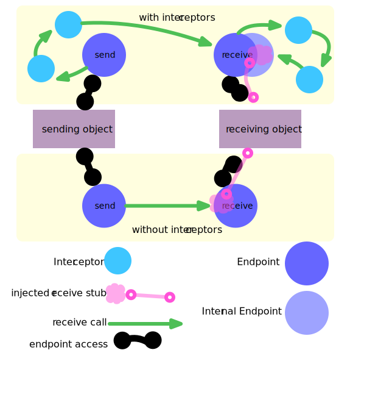

[](https://www.npmjs.com/package/@kronos-integration/endpoint)
[](https://opensource.org/licenses/BSD-3-Clause)
[](https://bundlejs.com/?q=@kronos-integration/endpoint)
[](https://npmjs.org/package/@kronos-integration/endpoint)
[](https://github.com/Kronos-Integration/endpoint/issues)
[](https://actions-badge.atrox.dev/Kronos-Integration/endpoint/goto)
[](https://github.com/prettier/prettier)
[](http://commitizen.github.io/cz-cli/)
[](https://snyk.io/test/github/Kronos-Integration/endpoint)
[](https://coveralls.io/github/Kronos-Integration/endpoint)

# kronos-endpoint

Named communication (end)-points inside of kronos

{:height="310pt" width="325pt"}

# API

<!-- Generated by documentation.js. Update this documentation by updating the source code. -->

### Table of Contents

*   [DummyReceiveEndpoint](#dummyreceiveendpoint)
    *   [receive](#receive)
    *   [isIn](#isin)
    *   [isOpen](#isopen)
    *   [isDummy](#isdummy)
*   [Endpoint](#endpoint)
    *   [Parameters](#parameters)
    *   [displayName](#displayname)
    *   [isDefault](#isdefault)
    *   [isDummy](#isdummy-1)
    *   [toStringAttributes](#tostringattributes)
    *   [connectionNamesWithStates](#connectionnameswithstates)
        *   [Parameters](#parameters-1)
    *   [isIn](#isin-1)
    *   [isOut](#isout)
    *   [direction](#direction)
    *   [jsonAttributes](#jsonattributes)
    *   [hasInterceptors](#hasinterceptors)
    *   [connectable](#connectable)
        *   [Parameters](#parameters-2)
    *   [hasConnections](#hasconnections)
    *   [isConnected](#isconnected)
        *   [Parameters](#parameters-3)
    *   [openConnection](#openconnection)
        *   [Parameters](#parameters-4)
    *   [closeConnection](#closeconnection)
        *   [Parameters](#parameters-5)
    *   [openConnections](#openconnections)
    *   [closeConnections](#closeconnections)
*   [isEndpoint](#isendpoint)
    *   [Parameters](#parameters-6)
*   [instanciateInterceptors](#instanciateinterceptors)
    *   [Parameters](#parameters-7)
*   [MultiConnectionEndpoint](#multiconnectionendpoint)
    *   [Parameters](#parameters-8)
    *   [getConnectionState](#getconnectionstate)
        *   [Parameters](#parameters-9)
    *   [setConnectionState](#setconnectionstate)
        *   [Parameters](#parameters-10)
    *   [isConnected](#isconnected-1)
        *   [Parameters](#parameters-11)
    *   [connections](#connections)
*   [MultiSendEndpoint](#multisendendpoint)
    *   [Parameters](#parameters-12)
    *   [isOut](#isout-1)
*   [ReceivableEndpoint](#receivableendpoint)
    *   [Parameters](#parameters-13)
    *   [isIn](#isin-2)
    *   [receive](#receive-1)
    *   [receive](#receive-2)
        *   [Parameters](#parameters-14)
*   [ReceiveEndpointDefault](#receiveendpointdefault)
    *   [isDefault](#isdefault-1)
*   [ReceiveEndpointSelfConnectedDefault](#receiveendpointselfconnecteddefault)
*   [ReceiveEndpoint](#receiveendpoint)
    *   [Parameters](#parameters-15)
    *   [isIn](#isin-3)
*   [SendEndpointDefault](#sendendpointdefault)
    *   [isDefault](#isdefault-2)
*   [SendEndpoint](#sendendpoint)
    *   [Parameters](#parameters-16)
    *   [isOut](#isout-2)

## DummyReceiveEndpoint

**Extends Endpoint**

Dummy endpoints are used during construction of the endpoint mesh.

### receive

dummy does nothing by intention

### isIn

Returns **[boolean](https://developer.mozilla.org/docs/Web/JavaScript/Reference/Global_Objects/Boolean)** true

### isOpen

Returns **[boolean](https://developer.mozilla.org/docs/Web/JavaScript/Reference/Global_Objects/Boolean)** true

### isDummy

Indicate whatever we are a dummy endpoint.
Dummy endpoints are used duiring construction of the endpoint mesh.

Returns **[boolean](https://developer.mozilla.org/docs/Web/JavaScript/Reference/Global_Objects/Boolean)** true

## Endpoint

Connection endpoint.

### Parameters

*   `name` **[string](https://developer.mozilla.org/docs/Web/JavaScript/Reference/Global_Objects/String)** endpoint name
*   `owner` **[Object](https://developer.mozilla.org/docs/Web/JavaScript/Reference/Global_Objects/Object)** of the endpoint (service)
*   `options` **[Object](https://developer.mozilla.org/docs/Web/JavaScript/Reference/Global_Objects/Object)**&#x20;

    *   `options.didConnect` **[Function](https://developer.mozilla.org/docs/Web/JavaScript/Reference/Statements/function)?** called after receiver is present
    *   `options.interceptors` **(Interceptor | [Array](https://developer.mozilla.org/docs/Web/JavaScript/Reference/Global_Objects/Array)<[Object](https://developer.mozilla.org/docs/Web/JavaScript/Reference/Global_Objects/Object)>)?** interceptors

### displayName

Name as presented for humans.

Returns **[string](https://developer.mozilla.org/docs/Web/JavaScript/Reference/Global_Objects/String)**&#x20;

### isDefault

Indicate whatever we are a default endpoint.
Default means buildin.

Returns **[boolean](https://developer.mozilla.org/docs/Web/JavaScript/Reference/Global_Objects/Boolean)** false

### isDummy

Indicate whatever we are a dummy endpoint.
Dummy endpoints are used duiring construction of the endpoint mesh.

Returns **[boolean](https://developer.mozilla.org/docs/Web/JavaScript/Reference/Global_Objects/Boolean)** false

### toStringAttributes

Mapping of properties used in toString.

Returns **[Object](https://developer.mozilla.org/docs/Web/JavaScript/Reference/Global_Objects/Object)**&#x20;

### connectionNamesWithStates

#### Parameters

*   `options` **[Object](https://developer.mozilla.org/docs/Web/JavaScript/Reference/Global_Objects/Object)**  (optional, default `{includeRuntimeInfo:true}`)

### isIn

Returns **[boolean](https://developer.mozilla.org/docs/Web/JavaScript/Reference/Global_Objects/Boolean)** false

### isOut

Returns **[boolean](https://developer.mozilla.org/docs/Web/JavaScript/Reference/Global_Objects/Boolean)** false

### direction

Deliver data flow direction.

Returns **[string](https://developer.mozilla.org/docs/Web/JavaScript/Reference/Global_Objects/String)** delivers data flow direction 'in', 'out', 'inout' or undefined

### jsonAttributes

Additional attributes to present in json output.

### hasInterceptors

Returns **[boolean](https://developer.mozilla.org/docs/Web/JavaScript/Reference/Global_Objects/Boolean)** true if there is at least one interceptor assigned

### connectable

Can we form a connection to the other side.
in to out and out to in.

#### Parameters

*   `other` **[Endpoint](#endpoint)**&#x20;

Returns **[boolean](https://developer.mozilla.org/docs/Web/JavaScript/Reference/Global_Objects/Boolean)** true if we can be connected to the other endpoint

### hasConnections

Returns **[boolean](https://developer.mozilla.org/docs/Web/JavaScript/Reference/Global_Objects/Boolean)** true if there is at least one connection

### isConnected

Are we connected to a endpoint.

#### Parameters

*   `other` **[Endpoint](#endpoint)** to check for the connection

Returns **[boolean](https://developer.mozilla.org/docs/Web/JavaScript/Reference/Global_Objects/Boolean)** true if there is a connection to the other endpoint

### openConnection

Actually start with the communication.

#### Parameters

*   `other` **[Endpoint](#endpoint)**&#x20;
*   `backpointer` **[boolean](https://developer.mozilla.org/docs/Web/JavaScript/Reference/Global_Objects/Boolean)** true if this is the call form back call from the other side

### closeConnection

Actually stop the communication.

#### Parameters

*   `other` **[Endpoint](#endpoint)**&#x20;
*   `backpointer` **[boolean](https://developer.mozilla.org/docs/Web/JavaScript/Reference/Global_Objects/Boolean)** true if this is the call form back call from the other side

### openConnections

Opens all connections.

### closeConnections

Closes all connections.

## isEndpoint

Check for Endpoint.

### Parameters

*   `object` **any** to be checked

Returns **[boolean](https://developer.mozilla.org/docs/Web/JavaScript/Reference/Global_Objects/Boolean)** true if object is an Endpoint

## instanciateInterceptors

Instanciate interceptors from its definitions.

### Parameters

*   `interceptors` **([Array](https://developer.mozilla.org/docs/Web/JavaScript/Reference/Global_Objects/Array)\<Interceptor> | [Array](https://developer.mozilla.org/docs/Web/JavaScript/Reference/Global_Objects/Array)\<Class> | [Array](https://developer.mozilla.org/docs/Web/JavaScript/Reference/Global_Objects/Array)<[String](https://developer.mozilla.org/docs/Web/JavaScript/Reference/Global_Objects/String)>)**&#x20;
*   `owner` **[Object](https://developer.mozilla.org/docs/Web/JavaScript/Reference/Global_Objects/Object)**&#x20;

Returns **[Array](https://developer.mozilla.org/docs/Web/JavaScript/Reference/Global_Objects/Array)\<Interceptor>**&#x20;

## MultiConnectionEndpoint

**Extends ReceivableEndpoint**

Multiple connection endpoint.
Can hold several connections.

### Parameters

*   `name` &#x20;
*   `owner` &#x20;
*   `options` &#x20;

### getConnectionState

Deliver connection state.

#### Parameters

*   `other` **Entpoint**&#x20;

Returns **any** our state for the connection to other

### setConnectionState

Set connection state.

#### Parameters

*   `other` **Entpoint**&#x20;
*   `state` **any** for the connection to other

### isConnected

Check connectivity.

#### Parameters

*   `other` **[Endpoint](#endpoint)**&#x20;

Returns **[boolean](https://developer.mozilla.org/docs/Web/JavaScript/Reference/Global_Objects/Boolean)** true if we are connected with other

### connections

All connections

## MultiSendEndpoint

**Extends MultiConnectionEndpoint**

Multiple Sending Endpoint.
Can hold several connections.
Back connections to any further endpoints will not be established

### Parameters

*   `name` **[string](https://developer.mozilla.org/docs/Web/JavaScript/Reference/Global_Objects/String)** endpoint name
*   `owner` **[Object](https://developer.mozilla.org/docs/Web/JavaScript/Reference/Global_Objects/Object)** of the endpoint (service)
*   `options` **[Object](https://developer.mozilla.org/docs/Web/JavaScript/Reference/Global_Objects/Object)**&#x20;

    *   `options.connected` **[Endpoint](#endpoint)?** where te requests are delivered to
    *   `options.didConnect` **[Function](https://developer.mozilla.org/docs/Web/JavaScript/Reference/Statements/function)?** called after receiver is present

### isOut

We are always *out*

Returns **[boolean](https://developer.mozilla.org/docs/Web/JavaScript/Reference/Global_Objects/Boolean)** always true

## ReceivableEndpoint

**Extends Endpoint**

### Parameters

*   `name` **[string](https://developer.mozilla.org/docs/Web/JavaScript/Reference/Global_Objects/String)** endpoint name
*   `owner` **[Object](https://developer.mozilla.org/docs/Web/JavaScript/Reference/Global_Objects/Object)** of the endpoint (service)
*   `options` **[Object](https://developer.mozilla.org/docs/Web/JavaScript/Reference/Global_Objects/Object)**&#x20;

    *   `options.receive` **[Function](https://developer.mozilla.org/docs/Web/JavaScript/Reference/Statements/function)?** reciever function
    *   `options.receivingInterceptors` **[Function](https://developer.mozilla.org/docs/Web/JavaScript/Reference/Statements/function)?**&#x20;

### isIn

Returns **[boolean](https://developer.mozilla.org/docs/Web/JavaScript/Reference/Global_Objects/Boolean)** true is receive function is present

### receive

Get the receive function.

Returns **[Function](https://developer.mozilla.org/docs/Web/JavaScript/Reference/Statements/function)**&#x20;

### receive

Set the receive function.

#### Parameters

*   `receive` **[Function](https://developer.mozilla.org/docs/Web/JavaScript/Reference/Statements/function)**&#x20;

## ReceiveEndpointDefault

**Extends ReceiveEndpoint**

Receive Endpoint acting as a default endpoints.

### isDefault

We are a default endpoint

Returns **[boolean](https://developer.mozilla.org/docs/Web/JavaScript/Reference/Global_Objects/Boolean)** always true

## ReceiveEndpointSelfConnectedDefault

**Extends ReceiveEndpointDefault**

Receiving endpoint wich can also send to itself.

## ReceiveEndpoint

**Extends MultiConnectionEndpoint**

Receiving Endpoint.
Can receive from several endpoints.
By default a dummy rejecting receiver is assigned

### Parameters

*   `name` **[string](https://developer.mozilla.org/docs/Web/JavaScript/Reference/Global_Objects/String)** endpoint name
*   `owner` **[Object](https://developer.mozilla.org/docs/Web/JavaScript/Reference/Global_Objects/Object)** of the endpoint (service)
*   `options` **[Object](https://developer.mozilla.org/docs/Web/JavaScript/Reference/Global_Objects/Object)**&#x20;

    *   `options.receive` **[Function](https://developer.mozilla.org/docs/Web/JavaScript/Reference/Statements/function)?** reciever function
    *   `options.connected` **[Endpoint](#endpoint)?** sending side

### isIn

We are always *in*

Returns **[boolean](https://developer.mozilla.org/docs/Web/JavaScript/Reference/Global_Objects/Boolean)** always true

## SendEndpointDefault

**Extends SendEndpoint**

Send Endpoint acting as a default endpoints.

### isDefault

We are a default endpoint

Returns **[boolean](https://developer.mozilla.org/docs/Web/JavaScript/Reference/Global_Objects/Boolean)** always true

## SendEndpoint

**Extends ReceivableEndpoint**

Sending Endpoint.
Can only hold one connection.
Back connections to any further endpoints will not be established

### Parameters

*   `name` **[string](https://developer.mozilla.org/docs/Web/JavaScript/Reference/Global_Objects/String)** endpoint name
*   `owner` **[Object](https://developer.mozilla.org/docs/Web/JavaScript/Reference/Global_Objects/Object)** of the endpoint (service)
*   `options` **[Object](https://developer.mozilla.org/docs/Web/JavaScript/Reference/Global_Objects/Object)**&#x20;

    *   `options.connected` **[Endpoint](#endpoint)?** where te requests are delivered to
    *   `options.didConnect` **[Function](https://developer.mozilla.org/docs/Web/JavaScript/Reference/Statements/function)?** called after receiver is present

### isOut

We are always *out*

Returns **[boolean](https://developer.mozilla.org/docs/Web/JavaScript/Reference/Global_Objects/Boolean)** always true

# install

With [npm](http://npmjs.org) do:

```shell
npm install kronos-endpoint
```

# license

BSD-2-Clause
