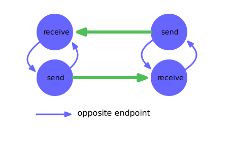

[](http://travis-ci.org/Kronos-Integration/endpoint)
[](http://codecov.io/github/Kronos-Integration/endpoint?branch=master)
[](http://commitizen.github.io/cz-cli/)
[](https://npmjs.org/package/endpoint)
[](https://github.com/Kronos-Integration/endpoint/issues)
[](https://greenkeeper.io/)
[](https://snyk.io/test/github/Kronos-Integration/endpoint)
[](https://opensource.org/licenses/BSD-3-Clause)
[](https://bundlephobia.com/result?p=@kronos-integration/endpoint)
[](https://www.npmjs.com/package/@kronos-integration/endpoint)
[](https://github.com/Kronos-Integration/endpoint)
[](https://github.com/prettier/prettier)

# kronos-endpoint

Named communication (end)-points inside of kronos

{:height="310pt" width="325pt"}

# API

<!-- Generated by documentation.js. Update this documentation by updating the source code. -->

### Table of Contents

-   [Endpoint](#endpoint)
    -   [Parameters](#parameters)
    -   [isDefault](#isdefault)
    -   [toStringAttributes](#tostringattributes)
    -   [isIn](#isin)
    -   [isOut](#isout)
    -   [isOpen](#isopen)
    -   [isConnected](#isconnected)
    -   [direction](#direction)
    -   [opposite](#opposite)
-   [InterceptedEndpoint](#interceptedendpoint)
    -   [Parameters](#parameters-1)
    -   [hasInterceptors](#hasinterceptors)
    -   [interceptors](#interceptors)
    -   [interceptors](#interceptors-1)
        -   [Parameters](#parameters-2)
-   [ReceiveEndpoint](#receiveendpoint)
    -   [Parameters](#parameters-3)
    -   [connected](#connected)
        -   [Parameters](#parameters-4)
    -   [sender](#sender)
    -   [isOpen](#isopen-1)
    -   [receive](#receive)
    -   [receive](#receive-1)
        -   [Parameters](#parameters-5)
    -   [isIn](#isin-1)
-   [ReceiveEndpointDefault](#receiveendpointdefault)
    -   [isDefault](#isdefault-1)
-   [SendEndpoint](#sendendpoint)
    -   [Parameters](#parameters-6)
    -   [isOut](#isout-1)
-   [SendEndpointDefault](#sendendpointdefault)
    -   [isDefault](#isdefault-2)
-   [isEndpoint](#isendpoint)
    -   [Parameters](#parameters-7)

## Endpoint

-   

### Parameters

-   `name` **[string](https://developer.mozilla.org/docs/Web/JavaScript/Reference/Global_Objects/String)** endpoint name
-   `owner` **[Object](https://developer.mozilla.org/docs/Web/JavaScript/Reference/Global_Objects/Object)** of the endpoint (service)
-   `options` **[Object](https://developer.mozilla.org/docs/Web/JavaScript/Reference/Global_Objects/Object)**  (optional, default `{}`)
    -   `options.opposite` **([Endpoint](#endpoint) \| [Object](https://developer.mozilla.org/docs/Web/JavaScript/Reference/Global_Objects/Object))?** opposite endpoint

### isDefault

Indicate whatever we are a default endpoint.
Default means buildin.

Returns **[boolean](https://developer.mozilla.org/docs/Web/JavaScript/Reference/Global_Objects/Boolean)** false

### toStringAttributes

mapping of properties used in toString

Returns **[Object](https://developer.mozilla.org/docs/Web/JavaScript/Reference/Global_Objects/Object)** 

### isIn

Returns **[boolean](https://developer.mozilla.org/docs/Web/JavaScript/Reference/Global_Objects/Boolean)** false

### isOut

Returns **[boolean](https://developer.mozilla.org/docs/Web/JavaScript/Reference/Global_Objects/Boolean)** false

### isOpen

Returns **[boolean](https://developer.mozilla.org/docs/Web/JavaScript/Reference/Global_Objects/Boolean)** false

### isConnected

Returns **[boolean](https://developer.mozilla.org/docs/Web/JavaScript/Reference/Global_Objects/Boolean)** false

### direction

Deliver data flow direction

Returns **[string](https://developer.mozilla.org/docs/Web/JavaScript/Reference/Global_Objects/String)** delivers data flow direction 'in', 'out' or undefined

### opposite

Deliver the opposite endpoint

Returns **[Endpoint](#endpoint)** representing the opposite direction

## InterceptedEndpoint

**Extends Endpoint**

Endpoint with a list of interceptors

### Parameters

-   `name` **[string](https://developer.mozilla.org/docs/Web/JavaScript/Reference/Global_Objects/String)** endpoint name
-   `owner` **[Object](https://developer.mozilla.org/docs/Web/JavaScript/Reference/Global_Objects/Object)** of the endpoint (service)
-   `options` **[Object](https://developer.mozilla.org/docs/Web/JavaScript/Reference/Global_Objects/Object)** 
    -   `options.interceptors` **(Interceptor | [Array](https://developer.mozilla.org/docs/Web/JavaScript/Reference/Global_Objects/Array)&lt;[Object](https://developer.mozilla.org/docs/Web/JavaScript/Reference/Global_Objects/Object)>)?** opposite endpoint

### hasInterceptors

Returns **[boolean](https://developer.mozilla.org/docs/Web/JavaScript/Reference/Global_Objects/Boolean)** true if there is at least one interceptor assigned

### interceptors

Deliver array of all assigned interceptors

Returns **[Array](https://developer.mozilla.org/docs/Web/JavaScript/Reference/Global_Objects/Array)&lt;Interceptor>** the interceptors or empty array if none are present

### interceptors

Set the interceptors
a connected chain from array element 0 over all entries up to the last element
in the array is formed.

#### Parameters

-   `newInterceptors` **[Array](https://developer.mozilla.org/docs/Web/JavaScript/Reference/Global_Objects/Array)&lt;Interceptor>** replaces all interceptors

## ReceiveEndpoint

**Extends InterceptedEndpoint**

Receiving Endpoint
by default a dummy rejecting receiver is assigned

### Parameters

-   `name` **[string](https://developer.mozilla.org/docs/Web/JavaScript/Reference/Global_Objects/String)** endpoint name
-   `owner` **[Object](https://developer.mozilla.org/docs/Web/JavaScript/Reference/Global_Objects/Object)** of the endpoint (service or step)
-   `options` **[Object](https://developer.mozilla.org/docs/Web/JavaScript/Reference/Global_Objects/Object)**  (optional, default `{}`)
    -   `options.receive` **[Function](https://developer.mozilla.org/docs/Web/JavaScript/Reference/Statements/function)?** reciever function

### connected

Connect other side to us

#### Parameters

-   `other` **[Endpoint](#endpoint)** endpoint to be connected to

### sender

Deliver the sending side Endpoint

Returns **[SendEndpoint](#sendendpoint)** the sending side

### isOpen

Are we able to receive requests

Returns **[boolean](https://developer.mozilla.org/docs/Web/JavaScript/Reference/Global_Objects/Boolean)** true if we are able to receive requests

### receive

get the receive function

Returns **[Function](https://developer.mozilla.org/docs/Web/JavaScript/Reference/Statements/function)** 

### receive

Set the receive function
If we know the sender we will inform him about our open/close state
by calling willBeClosed() and hasBeenOpened()

#### Parameters

-   `receive` **[Function](https://developer.mozilla.org/docs/Web/JavaScript/Reference/Statements/function)**  (optional, default `rejectingReceiver`)

### isIn

We are always _in_

Returns **[boolean](https://developer.mozilla.org/docs/Web/JavaScript/Reference/Global_Objects/Boolean)** always true

## ReceiveEndpointDefault

**Extends ReceiveEndpoint**

Receive Endpoint acting as a default endpoints

### isDefault

We are a default endpoint

Returns **[boolean](https://developer.mozilla.org/docs/Web/JavaScript/Reference/Global_Objects/Boolean)** always true

## SendEndpoint

**Extends ConnectorMixin(InterceptedEndpoint)**

Sending Endpoint

### Parameters

-   `name` **[string](https://developer.mozilla.org/docs/Web/JavaScript/Reference/Global_Objects/String)** endpoint name
-   `owner` **[Object](https://developer.mozilla.org/docs/Web/JavaScript/Reference/Global_Objects/Object)** of the endpoint (service or step)
-   `options` **[Object](https://developer.mozilla.org/docs/Web/JavaScript/Reference/Global_Objects/Object)**  (optional, default `{}`)
    -   `options.connected` **[Endpoint](#endpoint)?** where te requests are delivered to
    -   `options.opposite` **[Endpoint](#endpoint)?** endpoint going into the opposite direction
    -   `options.hasBeenOpened` **[Function](https://developer.mozilla.org/docs/Web/JavaScript/Reference/Statements/function)?** called after receiver is open
    -   `options.willBeClosed` **[Function](https://developer.mozilla.org/docs/Web/JavaScript/Reference/Statements/function)?** called before receiver is closed

### isOut

We are always _out_

Returns **[boolean](https://developer.mozilla.org/docs/Web/JavaScript/Reference/Global_Objects/Boolean)** always true

## SendEndpointDefault

**Extends SendEndpoint**

Send Endpoint acting as a default endpoints

### isDefault

We are a default endpoint

Returns **[boolean](https://developer.mozilla.org/docs/Web/JavaScript/Reference/Global_Objects/Boolean)** always true

## isEndpoint

check for Endpoint

### Parameters

-   `object` **any** 

Returns **[boolean](https://developer.mozilla.org/docs/Web/JavaScript/Reference/Global_Objects/Boolean)** true if object is an Endpoint

# install

With [npm](http://npmjs.org) do:

```shell
npm install kronos-endpoint
```

# license

BSD-2-Clause
