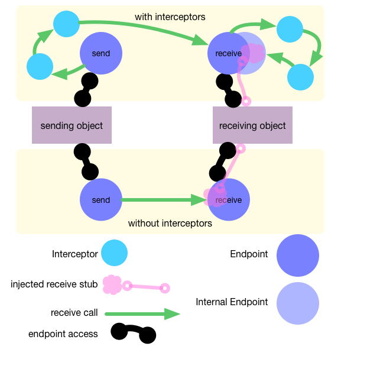

[](https://www.npmjs.com/package/kronos-endpoint)
[](https://greenkeeper.io/)
[](https://github.com/Kronos-Integration/kronos-endpoint)
[](https://github.com/prettier/prettier)
[](http://travis-ci.org/Kronos-Integration/kronos-endpoint)
[](https://www.bithound.io/github/Kronos-Integration/kronos-endpoint)
[](http://codecov.io/github/Kronos-Integration/kronos-endpoint?branch=master)
[](https://coveralls.io/r/Kronos-Integration/kronos-endpoint)
[](https://snyk.io/test/github/Kronos-Integration/kronos-endpoint)
[](https://github.com/Kronos-Integration/kronos-endpoint/issues)
[](http://waffle.io/Kronos-Integration/kronos-endpoint)
[](https://david-dm.org/Kronos-Integration/kronos-endpoint)
[](https://david-dm.org/Kronos-Integration/kronos-endpoint#info=devDependencies)
[](http://inch-ci.org/github/Kronos-Integration/kronos-endpoint)
[](https://github.com/sindresorhus/xo)
[](https://npmjs.org/package/kronos-endpoint)
[](http://commitizen.github.io/cz-cli/)

kronos-endpoint
=====
Named communication (end)-points inside of kronos



# API Reference

* <a name="set"></a>

## set()
If we know the sender we will inform him about our open/close state
by calling willBeClosed() and hasBeenOpened()

**Kind**: global function  

* <a name="<anonymous>..Endpoint"></a>

## &lt;anonymous&gt;~Endpoint(options)
possible options:
- opposite endpoint specify opposite endpoint
- createOpposite creates an opposite endpoint

**Kind**: inner method of <code>&lt;anonymous&gt;</code>  

| Param | Type |
| --- | --- |
| options | <code>Object</code> | 


* <a name="<anonymous>..ReceiveEndpoint"></a>

## &lt;anonymous&gt;~ReceiveEndpoint()
Set dummy rejecting receiver

**Kind**: inner method of <code>&lt;anonymous&gt;</code>  

* <a name="<anonymous>..SendEndpoint"></a>

## &lt;anonymous&gt;~SendEndpoint(options)
supported options:
- opposite endpoint
- hasBeenConnected() called after connected
- hasBeenDisconected() called after disconnected
- hasBeenOpened() called after receiver is open
- willBeClosed() called before receiver is closed

**Kind**: inner method of <code>&lt;anonymous&gt;</code>  

| Param | Type |
| --- | --- |
| options | <code>Object</code> | 


* * *

install
=======

With [npm](http://npmjs.org) do:

```shell
npm install kronos-endpoint
```

license
=======

BSD-2-Clause
